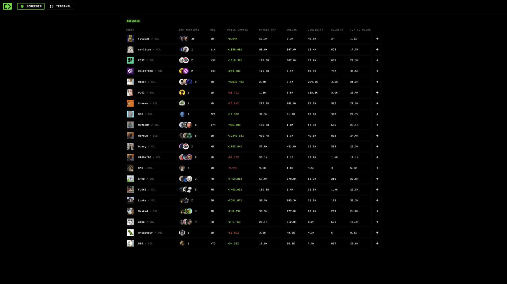
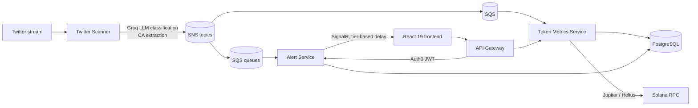

# CienceTerminal

Real-time crypto attention terminal: scans Twitter streams, classifies tweets with LLM inference, extracts and verifies Solana contract addresses on-chain, and pushes tiered alerts to clients over SignalR — before price discovery catches up.

Event-driven microservices on .NET 8 / AWS (SNS/SQS, ECS, RDS), React 19 frontend. Operated in production on AWS in 2025.



## Architecture



Four services, communicating **only** through SNS/SQS events — no inter-service HTTP. Each follows Clean Architecture (Domain / Application / Infrastructure / API) with CQRS via MediatR inside service boundaries.

| Service | Role |
|---|---|
| `services/api-gateway` | Single entry point; Auth0 JWT validation, YARP routing to backend services |
| `services/twitter-scanner` | Stream ingestion, Groq LLM tweet classification, Solana CA extraction, trend-state tracking (new → accelerating → declining → dying) |
| `services/alert-service` | SQS consumption, alert lifecycle, SignalR distribution with tier-based delivery delays (free = delayed, premium = instant) |
| `services/token-metrics-service` | Token metadata & metrics from Jupiter/Helius with hot/warm/cold cache tiers; publishes update events back into the mesh |
| `shared/` | Versioned event contracts, reusable SNS publisher / generic `SqsEventConsumer<TEvent>`, common utilities |
| `frontend/` | React 19 + TypeScript SPA — SignalR live updates, Auth0, kbar command palette, demo mode with mock data |

Database ownership is explicit: Token Metrics owns `coins` / `mention_aggregates` / `ca_mention_records`, Alert Service owns `alerts`, and cross-service access is read-only by construction (separate read-only DbContexts).

## Quick start

```bash
# Hybrid mode (recommended): LocalStack in Docker, services native, frontend hot-reload
./scripts/dev-start.sh

# Everything containerized
./scripts/dev-start.sh --docker

# Provision local SNS topics + SQS queues after LocalStack is up
./scripts/setup-aws-resources-docker.sh
```

Per-service configuration lives in service-local `.env` files — see the `.env.example` in each service directory. No secrets are committed; keys (Groq, Twitter, Helius, Auth0) are injected via environment. Frontend supports `VITE_DEMO_MODE=true` to run with mock data, no backend or auth required.

## Documentation

| Doc | Contents |
|---|---|
| [CLAUDE.md](CLAUDE.md) | Full architecture reference: services, data flow, DB schema, event topology, config patterns |
| [DEPLOYMENT_GUIDE.md](DEPLOYMENT_GUIDE.md) | Step-by-step AWS production deployment: RDS, SNS/SQS, ECR, ECS, ALB, Amplify, Auth0 |
| [docs/api-architecture.md](docs/api-architecture.md) | Gateway routing, SignalR hub flow, tier-based delivery, CORS, versioning strategy |
| [services/token-metrics-service/ARCHITECTURE.md](services/token-metrics-service/ARCHITECTURE.md) | Cache-tier design (hot/warm/cold), external API integration, cost optimization |
| [frontend/README.md](frontend/README.md) | Frontend setup, demo mode, and the in-progress styled-components refactor plan |
| [Product docs (GitBook)](https://cienceterminal.gitbook.io/cienceterminal-docs/) | User-facing platform documentation |

## Status

This repo is the December 2025 development state of the platform. The system ran in production on AWS (ECS + SNS/SQS + RDS + Amplify) with live users; a later production iteration with further frontend work post-dates this snapshot. Test projects are scaffolded in the solution layout but not implemented. The frontend is mid-refactor to a styled-components design system — `frontend/REFACTORING_PLAN.md` documents the target architecture.
